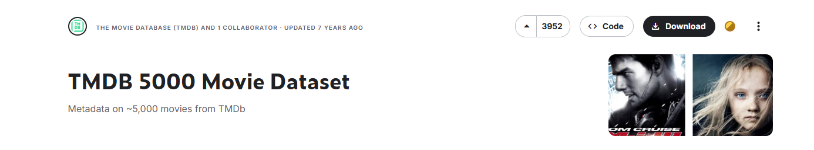

# 🎬 WikiMovies - Tu Mundo de Películas

Bienvenido a **MovieVerse**, el lugar donde puedes encontrar información sobre tus películas favoritas, descubrir nuevos títulos y compartir opiniones con la comunidad.

## 📌 Características
- 🎞️ [Base de datos con cientos de películas](https://www.kaggle.com/datasets/tmdb/tmdb-movie-metadata?resource=download&select=tmdb_5000_movies.csv).
- 🔍 Búsqueda avanzada.
- 📖 Muchísima información de todas las películas.

## 🫂​ Roles
- Administrador: gestión de usuarios y datos generales
- Editor: peliculas, personajes, casting, y datos relacionados
- Usuario común: entra en la aplicación y hace uso de ella (tiene un plan gratuito). Ver peliculas, añadir a favoritas, valorar con puntuación
- Recomendador de peliculas: Usuario premium. La aplicación te recomienda peliculas en función de tu perfil. No hace falta IA (Ej: si te gusta una peli de terror te recomienda una del mismo genero)
- Analista: Análisis de las bases de datos. Saca estadísticas como numero de peliculas de 5 estrellas, etc

## 🚀 Cómo Empezar
1. Clona el repositorio:
   ```bash
   git clone https://github.com/DRLKs/WikiMovies.git
   ```
2. Accede al directorio:
   ```bash
   cd WikiMovies
   ```
3. Sigue las instrucciones de instalación en la documentación.

## 🌍 Enlace al Proyecto
🔗 [Visita WikiMovies aquí]()

## 🤝 Contribuciones
¡Las contribuciones son bienvenidas! Si tienes ideas o mejoras, no dudes en hacer un **fork** y abrir un **pull request**.

---

💡 _¡Explora el mundo del cine con WikiMovie y únete a la comunidad cinéfila!_ 🎥🍿
